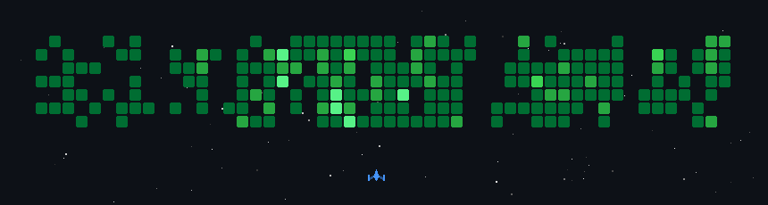

# Привет, я pxdxx

Разработка ПО, скрипты и расширения для браузера — от веба до нативных инструментов.

 

 

## Стек

 

## Чем занимаюсь

<table>
<tr>
<td width="50%" valign="top">

**Разработка**
- Разработка ПО и утилит
- Расширения для Chrome
- Приложения на Electron

</td>
<td width="50%" valign="top">

**Стек в деле**
- Python — скрипты и автоматизация
- PostgreSQL — работа с данными
- Swift — нативные штуки под macOS

</td>
</tr>
</table>

 

## GitHub статистика

  

 

